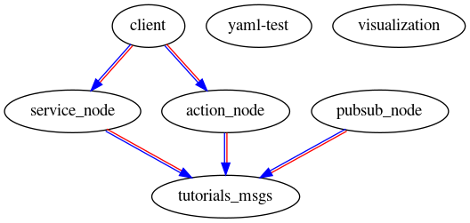

# A ROS2 Framework Test

## Objective

This repository aims to test ROS2 framework for building topic-based communication between nodes.
The framework is easy to use and supports several different means of message transmission.

It receives both common and user-defined data types, which are handled by independent nodes of the system.

## Node graph
