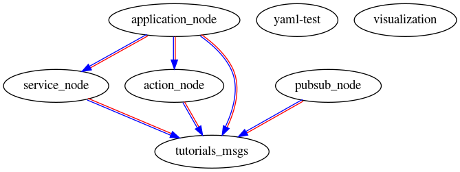
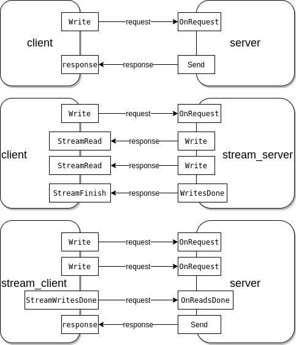

# A grpc-ROS2 Framework Test

## Objective

This repository aims to integrate grpc and ROS2 framework which supports action/service/topic-based communication between nodes.
The framework should be easy to use and supports several different means of message transmission.

It receives both common and user-defined data types, which are handled by independent nodes of the system.

## Node dependency graph

## Architecture

## gRPC

